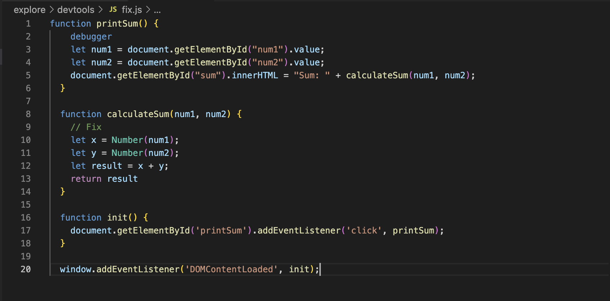

# DevTools Part 2

__Question 1:__ The bug is that num1 and num2 are getting saved as strings instead of numbers, so consequently "result" is returning a string (concatenation instead of addition).

&nbsp;

__Question 2:__ We can fix it by first converting converting "num1" and "num2" to numbers and sum them up like that.
